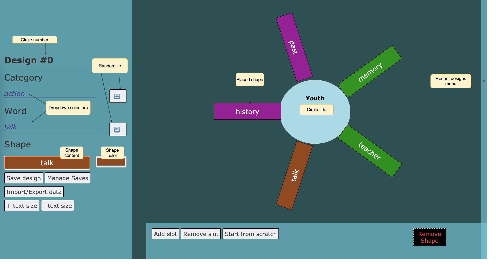

# Manual for ritual design tool
_How you can use this tool to design a ritual_

Please note that this manual doesn't include a methodology for designing rituals, it only describes how to use the tool as a step in this process.

## Purpose
This tool is designed to facilitate the process of designing rituals. It is the result of a collaboration between myself (Laurens) and an artist and ritual-maker. The tool helps the ritual maker visualize concepts which are relevant to the subject or subjects of the ritual.

A previous study produced a set of important keywords the ritual-maker has used in the past. These are are structured in a simple hierarchy. 'Categories', like _questions_, _relationships_, _issues_, _ideology_ are collections of keywords which may play a role in the ritual. The category 'narrative' for instance groups keywords like _'script', 'memory', 'myth'_.

During the process of designing a ritual, the ritual-maker will gather different keywords and categories by placing them around a circle. Each circle represents a part of the ritual. As each ritual is unique, no further constraints are placed on the design. As a result any number of categories and keywords can be placed around a circle. Optionally, new keywords can be written on the go.

## Designing a circle
A ritual consists of one or more circles. When loading the app, a template circle is available with several slots which can be filled with shapes. A shape has a color and a text value. The current circle's number is displayed at the top left. In the middle of the circle the title is written.

### Creating a new shape
Through the menu on the left hand side, a new shape can be edited before being added to the circle.

The first dropdown menu sets the category. It will limit the 'Word' options to keywords belonging to that category. Both the 'category' and 'word' dropdown have a randomize option. Selecting either a category or a word will cause the available 'shape' to be filled with text content.

An shape's color can be changed to allow shapes to be visually linked once placed in the design. Optionally, the text in the shape can be changed by hand, allowing for custom text content.

### Placing a shape
Once a new shape has the right color and text content, it can be dragged to an available 'slot' around the circle. Only empty slots can be filled. Dragging and dropping the available shape from the menu in a slot will cause a new shape to become available in the menu.

Through this process, the circle can be "filled" with relevant content.

## Editing the circle's layout
Often the ritual maker will want to restructure the circle. Several things can be edited:

- Shapes can be dragged over to different available slots
- The text content of a shape can be changed by hand
- Placed shapes can be deleted by dropping them on the 'Remove Shape' box
- Empty slots can be added to the circle through the 'Add slot' button
- Slots can also be removed using the 'Remove slot' button. This will remove the newest empty slot as **only empty slots can be removed**.
- 'Start from scratch' will delete all slots even if they are not empty and reset the circle's title.
- The size of the text in the circle's elements can be changed through the left hand menu.

## Working with multiple circles
Often a ritual will consist of more than one circle. For this purpose, multiple circles can be saved. The pop-out menu on the right hand side allows the ritual maker to quickly switch between saved designs.

### Saving a circle
Once the ritual maker has filled a circle with the right content, it can be saved using the 'Save design' button. This only saves the circle temporarily and **navigating away from the website will delete all saved designs**.

Make sure to edit the text in the middle of a circle to give it a meaningful title. You can also drag a shape to the circle to overwrite the title with the text content of that shape.

### Creating a new circle
The 'Manage saves' button brings up a screen where you can see all circles you have saved during this session. this is where you can create new circles. You can then load the new circle (or a previously saved circle) by selecting it and clicking 'Load design'.

### Switching quickly between circles
To allow for a seamless creative flow, you can switch between the most recently designed circles by using the menu on the right which pops out when you hover over it. Simply select a different circle previously saved to continue working on it.
**Don't forget to save the current circle before switching to a different circle**

## Exporting and importing designs
The tool has no database attached to it and no local storage is used. However, you can save your work yourself by exporting a code which represents your work. This way you can export your work as text, save it externally and import it into the tool later to continue working on it.

### Exporting a circle
- Save the circle you want to export
- Click the 'Import/Export' button in the menu on the left
- Click on 'Export Save' to generate the code which represents the circle
- Copy & Paste this text somewhere like in a text document.
- Exit the Import/Export screen to continue working

### Importing a circle
- Click the 'Import save' button in the Import/Export screen.
- Paste one of the code's you've previously saved or received from someone else. Make sure you copy the code exactly.
- Click 'Load data' and the tool will automatically save the loaded circle for you.
If the code is not correct the tool will let you know. All codes start with this bracket "{" and close with this bracket "}"
